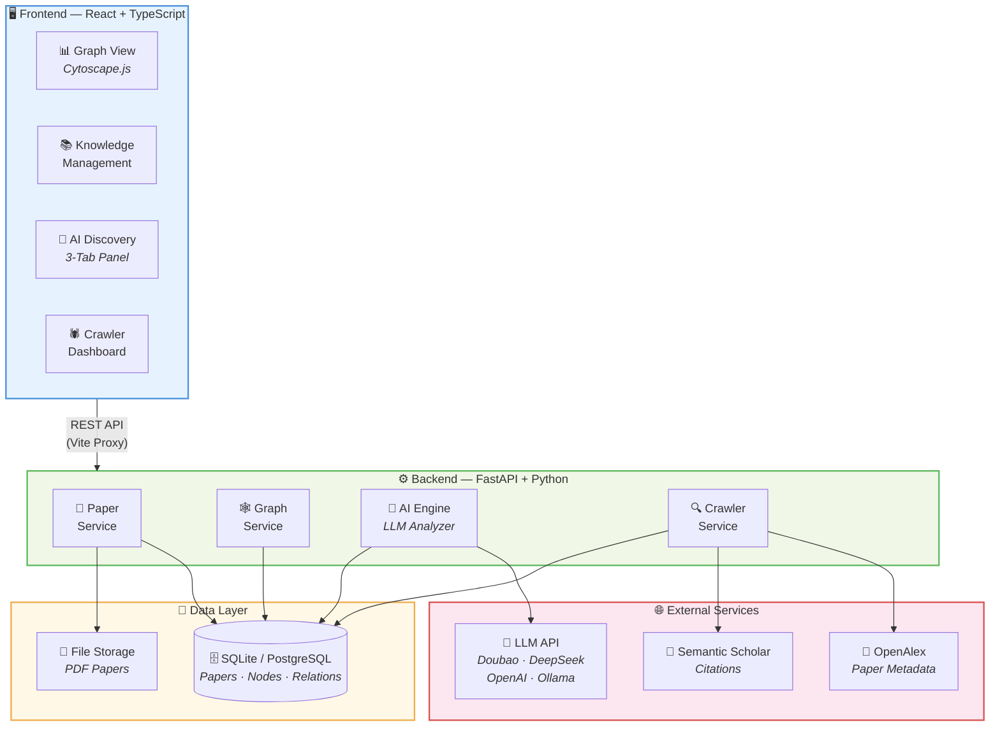
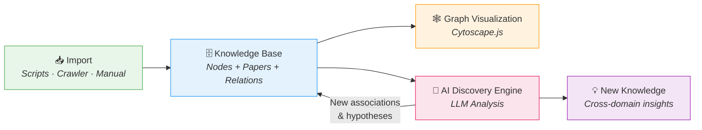

# Knowledge Nexus — Cross-Domain Knowledge Association Engine

[English](#-vision) | [中文](README_zh.md)

> Discover deep connections between seemingly unrelated concepts across domains. Weave isolated knowledge into an interconnected intelligence network, powered by AI.


---

## 🎯 Vision

Human knowledge is scattered across disciplines, yet many concepts are deeply connected:

| Domain A | ↔ | Domain B |
|---|---|---|
| Biology: **Natural Selection** | ↔ | CS: **Genetic Algorithm** |
| Physics: **Annealing** | ↔ | Optimization: **Simulated Annealing** |
| Neuroscience: **Neural Networks** | ↔ | Deep Learning: **Artificial Neural Networks** |
| Economics: **Game Theory** | ↔ | Multi-Agent: **Reinforcement Learning** |

**Knowledge Nexus** aims to:
1. **Build intra-domain knowledge graphs** — Map citation, inheritance, and improvement relationships between SOTA works within a domain
2. **Discover cross-domain associations** — Use AI to identify structural similarities and concept transfers across fields
3. **Generate new knowledge hypotheses** — Infer potential cross-domain inspirations and innovation directions

## ✨ Features

### 📚 Knowledge Base Management
- **8 knowledge node types**: phenomenon, theorem, law, method, concept, principle, process, structure
- **19 domains** covering natural sciences, social sciences, humanities, and engineering
- Paper metadata with PDF storage, DOI, arXiv ID, citation counts, impact scoring, and LLM-generated summaries
- Batch import via scripts or crawler, batch delete with cascading relation cleanup

### 🕸️ Interactive Knowledge Graph
- **Cytoscape.js**-powered graph visualization with domain-colored nodes
- **5 layout algorithms**: Force-directed (Cose), Circle, Concentric, Breadthfirst, Grid
- Search by keyword, filter by domain, toggle cross-domain mode
- Zoom, pan, drag, and click-to-focus interactions
- Full graph view + subgraph exploration (configurable depth 1–3)
- **13 relation types**: CITES, BUILDS_ON, IMPROVES, ANALOGOUS_TO, INSPIRES, INSPIRED_BY, PART_OF, ENABLES, RELATED_TO, CONTRADICTS, COMPETES_WITH, USED_BY, REVIEWS

### 🤖 AI Discovery Engine (LLM-Powered)
- **Cross-Domain Discovery** — AI scans knowledge nodes to find 5–10 hidden cross-domain associations per run, with confidence scores and visual indicators
- **Pair Analysis** — 6-dimensional deep analysis: structural analogy, causal links, complementarity, unified framework, and more
- **Knowledge Derivation** — Select 2–10 nodes and derive abstract patterns, transfer ideas, missing links, and new hypotheses with feasibility ratings
- **💬 Conversational AI Assistant** — ChatGPT-style multi-turn conversation interface for natural language exploration of the knowledge base, with skill-based auto-routing (search, discover, analyze, derive, summarize)
  - One-click **copy** to clipboard for any AI response
  - **Regenerate** (retry) button to re-generate any AI response, similar to GPT/Claude/Gemini — discards subsequent messages and retries from that point
  - Structured data cards for search results, discoveries, pair analyses, and derivations rendered inline
- Save discoveries as "pending review" or auto-confirm into the knowledge graph
- Domain filtering to focus discovery on specific fields
- Fuzzy matching with 3-level strategy for robust node identification
- Compatible with any OpenAI-format LLM API (Doubao, DeepSeek, OpenAI, Ollama)

### 🕷️ Smart Paper Crawler
- Multi-source crawling: OpenAlex, Semantic Scholar, arXiv
- Quality scoring based on citation count, venue prestige, and SOTA records
- Auto-download Open Access PDFs
- Rate-limited, resumable, deduplicated

### 🔍 Graph Exploration
- Domain-filtered subgraphs with configurable depth (1–3)
- Cross-domain mode highlighting inter-field connections
- Node detail panel with full metadata
- Citation threshold filtering for papers

## 📐 Architecture



### Data Flow



## 🛠️ Tech Stack

| Layer | Technology |
|-------|-----------|
| **Frontend** | React 18, TypeScript, Ant Design, Cytoscape.js, Vite |
| **Backend** | Python 3.11+, FastAPI, SQLAlchemy, Pydantic |
| **Database** | SQLite (dev), PostgreSQL (prod-ready) |
| **AI/LLM** | OpenAI-compatible API (Doubao, DeepSeek, OpenAI, Ollama) |
| **Crawler** | httpx, OpenAlex API, Semantic Scholar API |

## 🚀 Quick Start

### Prerequisites

- Python 3.11+
- Node.js 18+
- An LLM API key (Doubao, DeepSeek, OpenAI, or local Ollama)

### 1. Clone the Repository

```bash
git clone https://github.com/Harris-H/knowledge-nexus.git
cd knowledge-nexus
```

### 2. Backend Setup

```bash
cd backend

# Create virtual environment
python -m venv .venv
# Windows
.venv\Scripts\activate
# macOS/Linux
source .venv/bin/activate

# Install dependencies
pip install -r requirements.txt

# Configure environment
cp .env.example .env
# Edit .env — set your LLM_API_KEY

# Start the backend
uvicorn app.main:app --host 0.0.0.0 --port 8082 --reload
```

### 3. Frontend Setup

```bash
cd frontend

# Install dependencies
npm install

# Start dev server (auto-proxies API to backend)
npm run dev
```

### 4. Initialize Knowledge Base (Optional)

```bash
# Add cross-domain knowledge nodes
cd scripts
python add_cross_domain_knowledge.py
python add_cross_domain_knowledge_v2.py
python add_cs_knowledge_v3.py
python add_speech_ai_knowledge.py
python update_speech_domain.py
```

### 5. Open in Browser

Visit `http://localhost:3001` (or the port shown in terminal).

## 📁 Project Structure

```
knowledge-nexus/
├── README.md                    # English documentation
├── README_zh.md                 # 中文文档
├── backend/                     # FastAPI backend
│   ├── app/
│   │   ├── api/                 # API routes (papers, graph, ai, crawler)
│   │   ├── models/              # SQLAlchemy models (Paper, KnowledgeNode, Relation)
│   │   ├── schemas/             # Pydantic request/response models
│   │   ├── services/            # Business logic
│   │   │   ├── ai/              # LLM-powered discovery engine
│   │   │   ├── crawler/         # Paper crawling service
│   │   │   └── ...
│   │   └── core/                # Config, database setup
│   ├── .env.example             # Environment template
│   └── requirements.txt
├── frontend/                    # React + TypeScript frontend
│   ├── src/
│   │   ├── pages/               # Main pages
│   │   │   ├── GraphPage.tsx    # Knowledge graph visualization
│   │   │   ├── AIDiscoveryPage.tsx  # AI discovery (3 tabs)
│   │   │   ├── PapersPage.tsx   # Paper management
│   │   │   ├── KnowledgeNodesPage.tsx  # Knowledge node management
│   │   │   └── CrawlerPage.tsx  # Paper crawler
│   │   ├── api/                 # API client
│   │   ├── components/          # Shared components
│   │   └── types/               # TypeScript types
│   └── package.json
├── scripts/                     # Data import scripts
├── docs/                        # Design documents
│   ├── tech-stack.md
│   ├── architecture.md
│   ├── api-design.md
│   └── crawler-design.md
├── storage/                     # File storage (PDFs)
└── docker-compose.yml           # Docker setup (optional)
```

## 📊 Current Knowledge Base

| Domain | Nodes | Papers | Description |
|--------|-------|--------|-------------|
| 💻 Computer Science | 49 | ~26 | Full AI stack: Backpropagation → Transformer → LLM → Agent → MCP |
| 🎤 Speech AI | 12 | 18 | ASR, TTS, Voice Cloning, Neural Audio Codec, Speech LLM |
| 🧠 Philosophy | 22 | - | Reductionism, systems thinking, emergence, epistemology |
| 🎨 Art | 12 | - | Golden ratio, generative art, color theory, Gestalt, montage |
| 🧬 Biology | 10 | - | Evolution, genetics, CRISPR, symbiosis, central dogma |
| ⚛️ Physics | 10 | - | Thermodynamics, quantum mechanics, Noether's theorem, superconductivity |
| 📊 Mathematics | 10 | - | Graph theory, optimization, topology, Gödel's incompleteness |
| 🧪 Psychology | 10 | - | Conditioning, cognitive dissonance, working memory, conformity |
| 🔬 Chemistry | 12 | - | Periodic law, acid-base theory, redox, chirality, spectroscopy |
| 🌿 Ecology | 12 | - | Competitive exclusion, succession, nitrogen cycle, biodiversity |
| 💰 Economics | 12 | - | Supply-demand, Nash equilibrium, prospect theory, externalities |
| ⚙️ Engineering | 12 | - | FEA, redundancy, modular design, fatigue failure, PLM |
| 🧠 Neuroscience | 12 | - | Hebbian learning, LTP, synaptic pruning, BCI, lateral inhibition |
| 👥 Sociology | 12 | - | Social capital, weak ties, Dunbar's number, labeling theory |
| 🏥 Medicine | 12 | - | Dose-response, precision medicine, microbiome, medical imaging |
| 🧠 Cognitive Science | 12 | - | Metacognition, dual process, change blindness, situated cognition |
| 🌱 Life Science | 12 | - | Cell theory, autophagy, epigenetics, protein folding |
| ⚔️ Military Science | 12 | - | OODA loop, Lanchester's laws, wargaming, Art of War |
| 📜 History | 12 | - | Path dependence, Longue durée, Great Divergence, Occam's razor |

**Total: 267 nodes, 44 papers, 429+ relations, 19 domains, 8 node types**

## 🤖 LLM Configuration

Knowledge Nexus supports any OpenAI-compatible LLM API. Edit `backend/.env`:

```bash
# Doubao (ByteDance) — Default
LLM_API_KEY=your-api-key
LLM_BASE_URL=https://ark.cn-beijing.volces.com/api/v3
LLM_MODEL=doubao-seed-2-0-lite-260215

# DeepSeek
# LLM_BASE_URL=https://api.deepseek.com/v1
# LLM_MODEL=deepseek-chat

# OpenAI
# LLM_BASE_URL=https://api.openai.com/v1
# LLM_MODEL=gpt-4o-mini

# Local Ollama
# LLM_BASE_URL=http://localhost:11434/v1
# LLM_MODEL=qwen2.5
```

## 📸 Screenshots

### 🕸️ Knowledge Graph Visualization
Interactive graph powered by Cytoscape.js — domain-colored nodes, 13 relation types, search & filter toolbar.


### 🤖 AI Discovery Chat
ChatGPT-style conversational assistant with copy & regenerate buttons, structured data cards, and skill-based auto-routing.


### 📚 Knowledge Node Management
Browse, filter, and manage 267+ knowledge nodes across 19 domains with type tags, summaries, and year metadata.


## 🗺️ Roadmap

- [ ] Semantic search with vector embeddings
- [ ] PDF auto-parsing and metadata extraction
- [ ] Multi-user collaboration
- [ ] Knowledge timeline view
- [ ] Export to standard formats (RDF, OWL)
- [ ] Plugin system for custom domain adapters

## 📄 License

MIT
