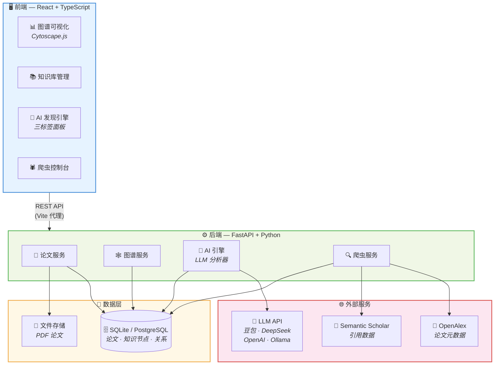
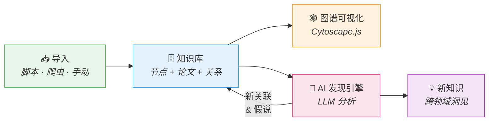
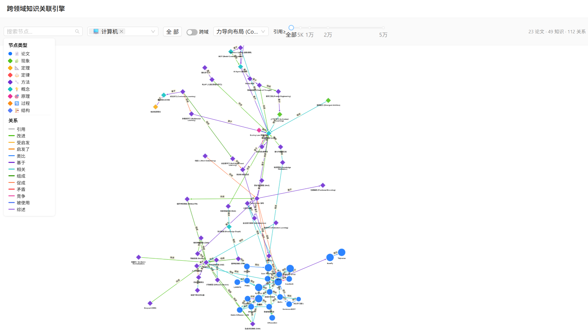
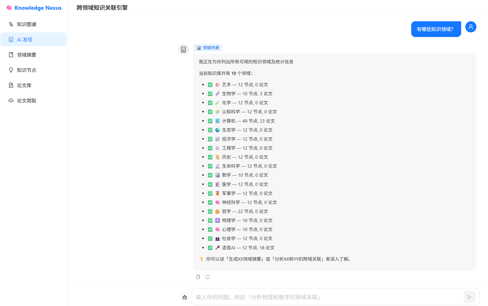
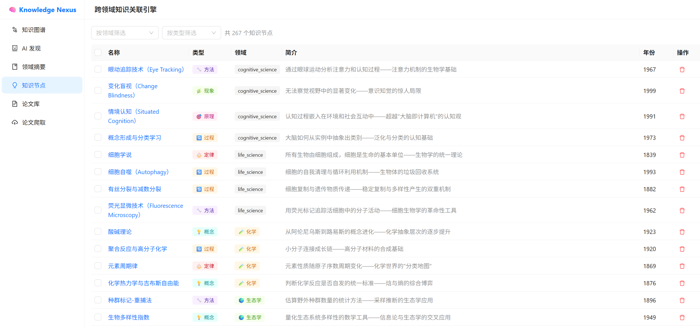

# Knowledge Nexus — 跨领域知识关联引擎

[English](README.md) | 中文

> 借助 AI 发现看似无关事物之间的深层关联，将孤立的知识点编织成互联互通的知识网络。


---

## 🎯 项目愿景

人类知识分散在不同领域中，但本质上许多概念跨域相通：

| 领域 A | ↔ | 领域 B |
|---|---|---|
| 生物学：**自然选择** | ↔ | 计算机：**遗传算法** |
| 物理学：**退火过程** | ↔ | 优化领域：**模拟退火** |
| 神经科学：**神经网络** | ↔ | 深度学习：**人工神经网络** |
| 经济学：**博弈论** | ↔ | 多智能体：**强化学习** |

**Knowledge Nexus** 旨在：
1. **构建领域内知识图谱** — 梳理单个领域中各 SOTA 工作之间的引用、继承、改进关系
2. **发现跨领域关联** — 利用 AI 识别不同领域知识之间的结构相似性与概念迁移
3. **生成新知识假说** — 基于已有关联模式，推断潜在的跨域启发与创新方向

## 📐 系统架构



### 数据流



## ✨ 核心功能

### 📚 知识库管理
- **8 种知识节点类型**：现象(phenomenon)、定理(theorem)、定律(law)、方法(method)、概念(concept)、原理(principle)、过程(process)、结构(structure)
- **19 个知识领域**覆盖自然科学、社会科学、人文学科和工程技术
- 论文元数据管理，支持 PDF 存储、DOI、arXiv ID、引用量、影响力评分和 LLM 生成的摘要
- 支持脚本批量导入和爬虫自动采集，批量删除并级联清理关联关系

### 🕸️ 交互式知识图谱
- 基于 **Cytoscape.js** 的图谱可视化，节点按领域着色
- **5 种布局算法**：力导向(Cose)、圆形、同心、层次、网格
- 关键词搜索、领域过滤、跨域模式切换
- 缩放、拖拽、点击聚焦等交互操作
- 完整图谱视图 + 子图探索（可配置深度 1–3 层）
- **13 种关系类型**：引用(CITES)、继承(BUILDS_ON)、改进(IMPROVES)、类比(ANALOGOUS_TO)、启发(INSPIRES)、受启发(INSPIRED_BY)、组成(PART_OF)、使能(ENABLES)、关联(RELATED_TO)、矛盾(CONTRADICTS)、竞争(COMPETES_WITH)、使用(USED_BY)、综述(REVIEWS)

### 🤖 AI 发现引擎（LLM 驱动）
- **🔍 跨域发现** — AI 扫描知识节点，每次发现 5–10 个跨领域隐藏关联，附带置信度评分和可视化指示器
- **🔬 配对分析** — 6 维深度分析：结构类比、因果联系、互补性、统一框架等
- **🧠 知识推导** — 选择 2–10 个节点，推导出抽象模式、迁移创意、缺失环节和新假说（含可行性评级）
- **💬 对话式 AI 助手** — 类 ChatGPT 多轮对话界面，支持自然语言探索知识库，自动路由至搜索、发现、分析、推导、摘要等技能
  - 一键**复制**任意 AI 回复到剪贴板
  - **重新生成**（重试）按钮，可对任意 AI 回复重新生成，参考 GPT/Claude/Gemini 设计 — 丢弃后续消息并从该位置重试
  - 搜索结果、发现关联、配对分析、知识推导等结构化数据卡片内联展示
- 发现结果可保存为"待审核"或"自动确认"状态写入知识图谱
- 支持领域过滤，聚焦特定领域的发现
- 三级模糊匹配策略，确保节点识别的鲁棒性
- 兼容任何 OpenAI 格式的 LLM API（豆包、DeepSeek、OpenAI、Ollama）

### 🕷️ 智能论文爬取
- 多数据源爬取：OpenAlex、Semantic Scholar、arXiv
- 基于引用量、顶会/顶刊、SOTA 记录的质量评分
- 自动下载 Open Access 论文 PDF
- 限流、断点续爬、去重

## 🛠️ 技术栈

| 层级 | 技术 |
|------|------|
| **前端** | React 18, TypeScript, Ant Design, Cytoscape.js, Vite |
| **后端** | Python 3.11+, FastAPI, SQLAlchemy, Pydantic |
| **数据库** | SQLite (开发), PostgreSQL (生产) |
| **AI/LLM** | OpenAI 兼容 API（豆包, DeepSeek, OpenAI, Ollama） |
| **爬虫** | httpx, OpenAlex API, Semantic Scholar API |

## 🚀 快速开始

### 环境要求

- Python 3.11+
- Node.js 18+
- LLM API Key（豆包 / DeepSeek / OpenAI 或本地 Ollama）

### 1. 克隆仓库

```bash
git clone https://github.com/Harris-H/knowledge-nexus.git
cd knowledge-nexus
```

### 2. 后端设置

```bash
cd backend

# 创建虚拟环境
python -m venv .venv
# Windows
.venv\Scripts\activate
# macOS/Linux
source .venv/bin/activate

# 安装依赖
pip install -r requirements.txt

# 配置环境变量
cp .env.example .env
# 编辑 .env，填入你的 LLM_API_KEY

# 启动后端
uvicorn app.main:app --host 0.0.0.0 --port 8082 --reload
```

### 3. 前端设置

```bash
cd frontend

# 安装依赖
npm install

# 启动开发服务器（自动代理 API 到后端）
npm run dev
```

### 4. 初始化知识库（可选）

```bash
cd scripts
python add_cross_domain_knowledge.py
python add_cross_domain_knowledge_v2.py
python add_cs_knowledge_v3.py
python add_speech_ai_knowledge.py
python update_speech_domain.py
```

### 5. 打开浏览器

访问终端显示的地址（默认 `http://localhost:3001`）。

## 📁 项目结构

```
knowledge-nexus/
├── README.md                    # 英文文档
├── README_zh.md                 # 中文文档（本文件）
├── backend/                     # FastAPI 后端
│   ├── app/
│   │   ├── api/                 # API 路由（论文、图谱、AI、爬虫）
│   │   ├── models/              # SQLAlchemy 模型（Paper, KnowledgeNode, Relation）
│   │   ├── schemas/             # Pydantic 请求/响应模型
│   │   ├── services/            # 业务逻辑
│   │   │   ├── ai/              # LLM 驱动的发现引擎
│   │   │   ├── crawler/         # 论文爬取服务
│   │   │   └── ...
│   │   └── core/                # 配置、数据库初始化
│   ├── .env.example             # 环境变量模板
│   └── requirements.txt
├── frontend/                    # React + TypeScript 前端
│   ├── src/
│   │   ├── pages/               # 主要页面
│   │   │   ├── GraphPage.tsx    # 知识图谱可视化
│   │   │   ├── AIDiscoveryPage.tsx  # AI 发现（3 标签页）
│   │   │   ├── PapersPage.tsx   # 论文管理
│   │   │   ├── KnowledgeNodesPage.tsx  # 知识节点管理
│   │   │   └── CrawlerPage.tsx  # 论文爬虫
│   │   ├── api/                 # API 客户端
│   │   ├── components/          # 通用组件
│   │   └── types/               # TypeScript 类型定义
│   └── package.json
├── scripts/                     # 数据导入脚本
├── docs/                        # 设计文档
│   ├── tech-stack.md            # 技术栈详解
│   ├── architecture.md          # 架构设计
│   ├── api-design.md            # API 设计
│   └── crawler-design.md        # 爬虫模块设计
├── storage/                     # 文件存储（PDF）
└── docker-compose.yml           # Docker 编排（可选）
```

## 📊 当前知识库

| 领域 | 知识节点 | 论文 | 说明 |
|------|---------|------|------|
| 💻 计算机科学 | 49 | ~26 | 完整 AI 技术栈：反向传播 → Transformer → LLM → Agent → MCP |
| 🎤 语音 AI | 12 | 18 | ASR、TTS、语音克隆、神经音频编解码、语音大模型 |
| 🧠 哲学 | 22 | - | 还原论、系统思维、涌现、认识论 |
| 🎨 艺术 | 12 | - | 黄金比例、生成艺术、色彩理论、格式塔、蒙太奇 |
| 🧬 生物学 | 10 | - | 进化、遗传、CRISPR、共生、中心法则 |
| ⚛️ 物理学 | 10 | - | 热力学、量子力学、诺特定理、超导 |
| 📊 数学 | 10 | - | 图论、优化、拓扑学、哥德尔不完备定理 |
| 🧪 心理学 | 10 | - | 条件反射、认知失调、工作记忆、从众效应 |
| 🔬 化学 | 12 | - | 元素周期律、酸碱理论、氧化还原、手性、光谱 |
| 🌿 生态学 | 12 | - | 竞争排斥、生态演替、氮循环、生物多样性 |
| 💰 经济学 | 12 | - | 供需法则、纳什均衡、前景理论、外部性 |
| ⚙️ 工程学 | 12 | - | 有限元、冗余设计、模块化、疲劳断裂、PLM |
| 🧠 神经科学 | 12 | - | 赫布学习、长时程增强、突触修剪、脑机接口、侧抑制 |
| 👥 社会学 | 12 | - | 社会资本、弱关系、邓巴数、标签理论 |
| 🏥 医学 | 12 | - | 剂量-反应、精准医学、微生物组、影像诊断 |
| 🧠 认知科学 | 12 | - | 元认知、双系统理论、变化盲视、情境认知 |
| 🌱 生命科学 | 12 | - | 细胞学说、自噬、表观遗传、蛋白质折叠 |
| ⚔️ 军事学 | 12 | - | OODA 循环、兰切斯特方程、沙盘推演、孙子兵法 |
| 📜 历史学 | 12 | - | 路径依赖、长时段理论、大分流、奥卡姆剃刀 |

**总计：267 个节点，44 篇论文，429+ 关系，19 个领域，8 种节点类型**

## 🤖 LLM 配置

Knowledge Nexus 支持任何 OpenAI 兼容的 LLM API。编辑 `backend/.env`：

```bash
# 豆包（字节跳动）— 默认
LLM_API_KEY=your-api-key
LLM_BASE_URL=https://ark.cn-beijing.volces.com/api/v3
LLM_MODEL=doubao-seed-2-0-lite-260215

# DeepSeek
# LLM_BASE_URL=https://api.deepseek.com/v1
# LLM_MODEL=deepseek-chat

# OpenAI
# LLM_BASE_URL=https://api.openai.com/v1
# LLM_MODEL=gpt-4o-mini

# 本地 Ollama
# LLM_BASE_URL=http://localhost:11434/v1
# LLM_MODEL=qwen2.5
```

## 📸 截图

### 🕸️ 知识图谱可视化
基于 Cytoscape.js 的交互式图谱 — 节点按领域着色，支持 13 种关系类型、搜索与过滤工具栏。



### 🤖 AI 发现对话
类 ChatGPT 对话式助手，支持复制与重新生成按钮、结构化数据卡片、技能自动路由。



### 📚 知识节点管理
浏览、过滤和管理 267+ 知识节点，覆盖 19 个领域，含类型标签、简介和年份信息。



## 🗺️ 开发路线

- [ ] 基于向量嵌入的语义搜索
- [ ] PDF 自动解析与元数据提取
- [ ] 多用户协作
- [ ] 知识时间线视图
- [ ] 导出为标准格式（RDF、OWL）
- [ ] 自定义领域适配器插件系统

## 📄 开源协议

MIT
